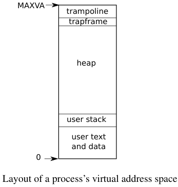
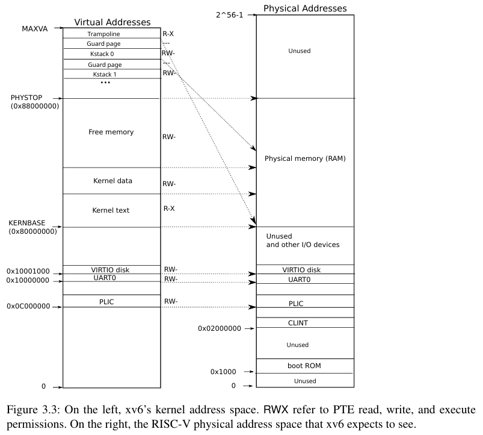

三种情况会导致CPU暂停常规指令执行
- 系统调用：当用户执行ecall请求内核做某事
- 异常：执行非法操作，除以零或使用无效内存
- 设备中断：如磁盘硬件完成一次读或写请求
trap 作为这些情况的通用术语，通常，发生trap时正在执行的代码稍后需要恢复执行
# RISC-V trap machinery(陷阱机制)
每个 RISC-V CPU 都有一组控制寄存器，内核会写入这些寄存器以告诉 CPU 如何处理陷阱，并且内核可以读取这些寄存器以了解发生了什么陷阱。
- `stvec`内核在这里写入其陷阱处理程序的地址；RISC-V 会跳转到 stvec 中的地址来处理陷阱。
- `sepc`当发生陷阱时，RISC-V 会将程序计数器的值保存在这里（因为 pc 随后会被 stvec 中的值覆盖）。`sret`（从陷阱返回）指令会将`sepc`复制到pc。内核可以写入 `sepc`以控制`sret`的目标位置。
- `scause`RISC-V 在这里放一个数字来描述触发陷阱的原因。
- `sscratch`中断处理代码使用`sscratch`来帮助它在保存用户寄存器之前避免覆盖用户寄存器。
- `sstatus`中`SIE`位控制设备中断是否启用。如果内核清除了`SIE`，RISC-V 将会延迟设备中断，直到内核重新设置`SIE`。`SPP`位表示陷阱来自用户模式还是监督模式，并控制`sret`返回到哪种模式。

上述寄存器与在监督模式处理的陷阱有关，它们在用户模式下无法读取或写入。

当需要强制产生陷阱时，RISC-V 硬件会对所有陷阱类型（除了定时器中断）执行以下操作：
1. 如果陷阱是设备中断，并且 sstatus SIE 位未设置，则不要执行以下任何操作
2. （如果trap的原因不是设备中断）通过清除SIE禁用中断
3. 将 pc 复制到 sepc
4. 将当前模式（用户或监督程序）保存到 sstatus 中的 SPP 位
5. 设置 scause 以反映该陷阱的原因
6. 将模式设置为监督程序模式
7. 将 stvec 复制到 pc
8. 在新的pc上继续执行

CPU不会切换到内核页表，不会切换到内核中的堆栈，也不会保存除pc之外的任何寄存器

# Traps from user space(来自用户空间的陷阱)
陷阱从用户空间的路径是`uservec`,然后是`usertrap`;返回时`usertrapret`然后`userret`

1. RISC - V 硬件陷阱期间页表不切换
在 RISC - V 架构里，当发生陷阱（比如系统调用、异常等情况）时，硬件不会自动切换页表。陷阱是程序执行过程中遇到的特殊情况，通常需要操作系统介入处理。
2. 用户页表需包含uservec映射
由于陷阱发生时页表不切换，为了能正确跳转到陷阱处理代码uservec（stvec指向的陷阱向量指令），用户页表中必须有对uservec的映射。stvec是一个特殊寄存器，它存储着陷阱向量表的起始地址，当陷阱发生时，CPU 会根据stvec的值跳转到相应的处理代码。
3. uservec需切换satp指向内核页表
uservec作为陷阱处理代码的一部分，在处理陷阱时，需要从用户空间切换到内核空间。这通过切换satp寄存器的值来实现，satp寄存器用于存储当前使用的页表基地址，将其指向内核页表，就可以进入内核空间。
4. uservec需映射到内核页表相同地址

为了保证在页表切换前后，uservec在用户空间和内核空间都能正常运行，需要将uservec映射到内核页表中与用户页表相同的地址。这样在切换页表时，程序计数器指向的uservec地址不会因为页表的改变而失效，确保了代码执行的连续性。

当陷阱发生时，由于硬件不切换页表，此时使用的是用户页表。而陷阱处理代码通常在内核空间执行，需要访问内核的代码和数据，这些内容是通过内核页表进行映射的。如果不切换到内核页表，就无法正确访问内核空间的相关资源，所以uservec需要切换satp寄存器以指向内核页表，这样才能进入内核空间执行相应的处理操作。

通过往用户虚拟地址空间和内核虚拟地址空间的顶端放置trampoline页（其中包含uservec）， 并且（当执行用户代码时）stvec被设置为uservec。

Xv6 使用_trampoline 页面来满足这些要求。__trampoline 页面包含 uservec，这是 stvec 指向的 xv6 陷阱处理代码。__trampoline 页面在每个进程的页表中映射到地址 TRAMPOLINE，该地址位于虚拟地址空间的顶部，因此会高于程序为自己使用的内存。__trampoline 页面也在内核页表中以地址 TRAMPOLINE 映射。



当 uservec 开始执行时，所有 32 个寄存器都包含中断用户代码的所有值。这些 32 个值需要保存在内存中的某个地方，以便在陷阱返回用户空间时可以恢复。但是uservec需要能够修改一些寄存器，以便设置satp并生成保存寄存器的地址。RISC-V以sscratch寄存器的形式提供了帮助。uservec开头的csrrw指令交换a0和sscratch的内容。内核在返回用户空间之前，就将该进程的trapframe放置进sscratch中。因此交换后在sscratch中保存了原来用户代码的a0，而a0现在装载着之前由内核设置的该进程的trapframe。

uservec 接下来的任务是保存用户寄存器。内核为每个进程分配一页内存来存储`trapframe`(包括32个用户寄存器的空间)。satp指向用户页表,uservec需要将trapframe映射到用户地址空间(trapframe通常位于内核地址空间)

uservec将trapframe地址加载到a0寄存器并保存所有的用户寄存器到trapframe，a0寄存器的值从sscratch 中读取

trapframe包含每个进程的内核栈的地址，CPU的hartid，usertrap函数地址，内核页表的地址
- 每个进程都有自己的内核栈，用于在内核态执行时保存函数调用栈、局部变量等。trapframe中保存内核栈地址确保内核能够正确切换到当前进程的内核栈
- 保存hartid可以帮助内核知道当前异常或中断是在哪个CPU核心上触发的，这对于多核调度和同步非常重要
- usertrap是用于处理用户态陷阱的主要函数，在 uservec 保存完用户态上下文后，会跳转到 usertrap 函数继续处理异常或中断。trapframe 中保存的 usertrap 地址使得这一跳转可以正确执行。
- 当从用户态切换到内核态时，需要将页表从用户页表切换到内核页表。trapframe 中保存的内核页表地址使得这一切换可以正确完成。


# gdb
一个终端`make qemu-gdb`
一个终端`gdb-multiarch`并且`target remote :26000`，使用`layout split`
## 指令
```
break/b *地址/函数名 设置断点
continue/c 运行到断点然后停下
```

# 寄存器
- ra(return address)保存函数调用后返回的地址 

# RISC-V assembly 
```li	a2,13```对应```printf("%d %d\n", f(8)+1, 13);```
将13加载到a2寄存器
这里没有直接调用函数f和g是被编译器优化了

# Backtrace
GCC 编译器将当前执行函数的帧指针存储在寄存器 s0 中

返回地址位于堆栈帧的帧指针固定偏移量（-8）处，而保存的帧指针位于帧指针的固定偏移量（-16）处。

```c
    uint64 ra = *(uint64 *)(fp - 8);
    printf("%p\n",ra);
    fp = *(uint64*)(fp - 16);
```

给定栈的所有栈帧在同一页上

# Alarm
每次调用sigalarm将tick和函数指针handler传入内核,每次xv6进行时钟中断时就去检测是否到了tick的时间，如果到了就触发该函数，通过设置trapframe->epc，当进程返回到用户态时，就会将pc设置为trapframe->epc的值。但是如果这样简单的返回用户态，那么handler函数执行完毕，进程就跑飞了，因为没有下面一步的pc了，这个pc已经被覆盖了。所以我们需要事先将一些信息保存起来，当sigreturn时恢复。

在这里直接拷贝了一份trapframe中的数据到添加的alarm_frame中，在sigreturn的时候再恢复